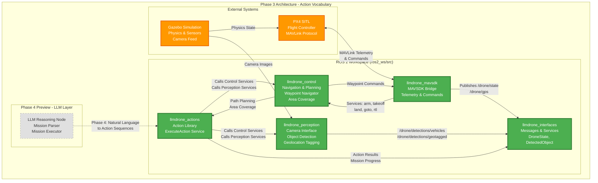

# Phase 3 - Action Vocabulary

**Status**: Not Started
**Dependencies**: Phase 2 (mission definitions and environments)

> **Quick Reference**: See [Phase-3-Action-Vocabulary-Summary.md](Phase-3-Action-Vocabulary-Summary.md) for a concise overview of the hybrid architecture approach and action hierarchy.

## Objective
Build the fundamental action primitives, navigation capabilities, and perception models from the ground up. This phase creates the **vocabulary** that the LLM will use to command the drone. By the end, we should be able to manually script a mission using these actions.

**Critical Design Decision**: This phase implements a **two-layer hybrid architecture** separating strategic actions (LLM-facing) from tactical primitives (execution layer). This ensures the LLM handles high-level reasoning while proven algorithms (A*, PID control) handle safety-critical flight control.

**Phase 4 Architecture Revision**: Strategic actions output **behavior trees** (not fixed JSON sequences) to support conditional logic and iterative refinement required for real missions.

## Rationale
The LLM can only do what we give it the tools to do. Before integrating language models, we need:
- **Navigation primitives**: How does the drone move? (waypoints, area coverage, return-home)
- **Perception capabilities**: What can the drone detect? (vehicles, anomalies, terrain)
- **Action primitives**: What atomic commands can we execute? (takeoff, land, orbit, search)

This phase is about building the **actuators** that respond to high-level commands. Think of it as creating the API that the LLM will call.

## System Architecture



**Key Components Built in Phase 3**:
- **llmdrone_mavsdk**: Translates between ROS 2 and PX4 MAVLink protocol
- **llmdrone_control**: Waypoint navigation, path planning (A*), area coverage patterns
- **llmdrone_perception**: Camera processing, YOLO object detection, GPS geolocation tagging
- **llmdrone_actions**: High-level action primitives (TAKEOFF, SEARCH_AREA, DETECT_VEHICLES, RTL, etc.)
- **llmdrone_interfaces**: Custom ROS 2 message/service definitions

**Phase 4 Preview**: The LLM layer (shown in gray) will call the action library to execute missions from natural language.

## Goals
1. **ROS 2 Workspace Setup**: Create minimal ROS 2 packages for control, perception, and interfaces
2. **MAVSDK Integration**: Bridge between ROS 2 and PX4 for flight control
3. **Navigation Primitives**: Implement path planning (A*, waypoint following) and area coverage
4. **Perception Models**: Integrate object detection for vehicles and basic anomaly detection
5. **Action Library**: Define and implement 8-12 atomic actions (takeoff, navigate, search, detect, RTH, etc.)
6. **Manual Mission Execution**: Fly Mission 1 using scripted sequence of actions (no LLM yet)

## Success Criteria
- [ ] ROS 2 nodes controlling drone via MAVSDK in simulation
- [ ] Can navigate to waypoints using path planning
- [ ] Area coverage pattern works (lawnmower search)
- [ ] Object detection running on simulated camera feed
- [ ] 8-12 documented action primitives implemented
- [ ] Mission 1 executed successfully using manually scripted action sequence
- [ ] All actions testable via ROS 2 service calls or topics

## Tasks

### 3.1 ROS 2 Workspace & MAVSDK Bridge

#### ROS 2 Setup
- [ ] Create `ros2_ws/src/` structure with packages:
  - `llmdrone_interfaces/`: Custom ROS 2 messages and services
  - `llmdrone_control/`: Flight control and navigation nodes
  - `llmdrone_perception/`: Vision and sensor processing
  - `llmdrone_mavsdk/`: MAVSDK bridge for MAVLink communication
  - `llmdrone_actions/`: Action primitive implementations

- [ ] Define core ROS 2 interfaces in `llmdrone_interfaces/`:
  - `msg/DroneState.msg`: Position, velocity, battery, mode
  - `msg/DetectedObject.msg`: Class, position, confidence
  - `srv/ExecuteAction.srv`: Action name, parameters → success, result
  - `srv/NavigateTo.srv`: Target position → path, ETA
  - `action/Mission.action`: Goal, feedback, result for mission execution

#### MAVSDK Bridge
- [ ] Install MAVSDK (C++ or Python bindings)
- [ ] Create `mavsdk_bridge_node` in `llmdrone_mavsdk/`:
  - Subscribe to PX4 telemetry (position, attitude, battery, GPS)
  - Publish to ROS 2 topics: `/drone/state`, `/drone/gps`
  - Expose ROS 2 services for:
    - `/drone/arm`: Arm motors
    - `/drone/takeoff`: Takeoff to altitude
    - `/drone/land`: Land at current position
    - `/drone/goto`: Navigate to waypoint
    - `/drone/rtl`: Return to launch
  - Handle offboard mode switching

- [ ] Test MAVSDK bridge:
  - Launch PX4 SITL + Gazebo
  - Start bridge node
  - Verify telemetry published to ROS topics
  - Test arm/takeoff/land via ROS services
  - Confirm offboard control works

**Deliverable**: ROS 2 workspace with MAVSDK bridge controlling simulated drone

### 3.2 Navigation Primitives

#### Waypoint Navigation
- [ ] Implement `waypoint_navigator_node` in `llmdrone_control/`:
  - Accept target waypoint (GPS or local coordinates)
  - Plan path from current position to target
  - Handle altitude constraints and geofencing
  - Publish trajectory commands via MAVSDK bridge
  - Report progress and completion

- [ ] Implement basic path planning:
  - Start with straight-line navigation (A* comes later)
  - Add obstacle detection awareness (simple collision checking)
  - Handle waypoint sequencing (chain of waypoints)

#### Area Coverage Planning
- [ ] Implement `area_coverage_node` in `llmdrone_control/`:
  - Input: Polygon boundary defining search area
  - Output: Lawnmower or spiral pattern covering area
  - Parameters: Altitude, spacing, overlap percentage
  - Generate waypoint sequence for coverage

- [ ] Test area coverage:
  - Define NAI 3 boundary from Mission 1
  - Generate coverage pattern
  - Fly pattern in simulation
  - Measure coverage percentage

#### Path Planning (A* or RRT*)
- [ ] Research path planning options:
  - **A\* for static obstacle avoidance**: Grid-based, fast for known obstacles, suitable if Phase 2 worlds have fixed obstacles
  - **RRT\* (Optimal RRT) for dynamic scenarios**: Sampling-based, handles moving obstacles, required for Phase 5 replanning
  - Simple potential fields for local reactive avoidance

  **Decision criteria**:
  - If Phase 2 missions only have static obstacles → A* sufficient for Phase 3
  - If missions require dynamic obstacle handling → implement RRT* from start
  - **Recommendation**: Start with A*, add RRT* in Phase 5 if needed (avoid premature complexity)

- [ ] Implement A* path planner in `llmdrone_control/path_planner.py`:
  - Occupancy grid costmap (resolution: 0.5m cells)
  - Service: `/control/plan_path(start, goal, constraints) → Path`
  - Constraints: max altitude, geofence polygon, no-fly zones
  - Replan on obstacle detection (triggered by costmap updates)
  - **Performance requirement**: <100ms for typical 100m×100m area

- [ ] Add path validation:
  - Check path stays within geofence
  - Verify altitude constraints
  - Calculate estimated time and battery consumption
  - Return failure if infeasible

- [ ] Note: Full SLAM (mapping unknown environments) deferred to Phase 5

**Deliverable**: Waypoint navigation and area coverage working in simulation

### 3.3 Perception Pipeline

#### Camera Integration
- [ ] Configure Gazebo camera sensor on custom drone
- [ ] Create `camera_interface_node` in `llmdrone_perception/`:
  - Subscribe to Gazebo camera topic (raw images)
  - Republish to ROS 2: `/drone/camera/image_raw`
  - Publish camera info (intrinsics, resolution)

#### Object Detection - Vehicles
- [ ] Select detection model:
  - YOLO (v8 or v11) for real-time detection
  - Pre-trained on COCO dataset (includes vehicles)
  - Consider TensorRT optimization for edge deployment later

- [ ] Implement `vehicle_detector_node` in `llmdrone_perception/`:
  - Subscribe to camera feed
  - Run inference on each frame (configurable rate)
  - Detect vehicles (car, truck classes)
  - Publish detections to `/drone/detections/vehicles`
  - Include bounding box, class, confidence

- [ ] Add geolocation tagging:
  - Use drone position + camera parameters
  - Project detection to ground plane (**assumes flat terrain—document this limitation**)
  - Attach GPS coordinates to each detection
  - Publish to `/drone/detections/geotagged`

- [ ] **Model detection range and altitude tradeoffs**:
  - Create `docs/perception_performance.md` documenting:
    - **Effective detection range**: YOLO at 1080p typically 30-50m horizontal
    - **Altitude vs detection tradeoff**: At 50m AGL, ground objects are at detection limit
    - **Optimal flight altitude for vehicle detection**: 30-40m AGL for 1080p camera
    - **Confidence degradation curve**: Plot confidence vs distance/altitude (measured in simulation)
  - Add altitude recommendations to strategic action parameters (SEARCH_AREA should suggest 30-40m)
  - **Warning**: Simulation detection will be 20-40% better than real-world; account for this in Phase 6

- [ ] **Sim-to-real gap mitigation**:
  - Document expected performance drop on real imagery
  - Plan domain randomization in Gazebo (lighting variations, texture noise) for Phase 4/5
  - Reserve budget for fine-tuning on real drone imagery in Phase 6

#### Anomaly Detection (Basic)
- [ ] Implement simple anomaly detection:
  - Background subtraction or change detection
  - Highlight non-terrain objects
  - Flag for further inspection
  - This is a basic placeholder for Mission 2

- [ ] Or defer to Phase 4/5 if time constrained

**Deliverable**: Vehicle detection working on simulated camera with geolocation

### 3.4 Action Primitive Library

Define and implement **action primitives** organized into two layers matching the hybrid autonomy architecture:

1. **Strategic Actions** (LLM Layer): High-level mission tasks the LLM orchestrates
2. **Tactical Primitives** (Execution Layer): Low-level commands executed by traditional planners

This separation ensures the LLM handles reasoning/adaptation while proven algorithms handle safety-critical navigation.

#### Action Hierarchy Overview
```
┌─────────────────────────────────────────────────────────────┐
│  Phase 4: LLM Layer (Natural Language → Strategic Actions)  │
│  "Survey NAI 3 for vehicles"                                 │
└───────────────────────────┬─────────────────────────────────┘
                            │ Calls strategic action
                            ▼
┌─────────────────────────────────────────────────────────────┐
│  Strategic Actions (Mission-Level Composition)              │
│  • SEARCH_AREA(boundary, pattern, altitude)                 │
│  • INVESTIGATE_LOCATION(coord, radius, duration)            │
│  • TRACK_TARGET(target_id, max_duration)                    │
│  • SURVEY_ROUTE(waypoints, stop_duration)                   │
│  • ESTABLISH_OVERWATCH(position, watch_area)                │
│  • RETURN_TO_BASE(reason)                                   │
└───────────────────────────┬─────────────────────────────────┘
                            │ Decomposes into
                            ▼
┌─────────────────────────────────────────────────────────────┐
│  Tactical Primitives (Flight Control)                       │
│  • arm() / takeoff(alt) / land()                            │
│  • goto_waypoint(gps, alt, speed) ← Uses A*/RRT*            │
│  • hold_position(duration)                                  │
│  • orbit(center, radius, alt)                               │
│  • set_speed() / set_heading() / set_gimbal()               │
│                                                              │
│  Perception Actions (Sensor Control)                        │
│  • detect_objects(duration, classes)                        │
│  • capture_image(tag) / start_video() / stop_video()        │
│  • measure_elevation(location)                              │
└───────────────────────────┬─────────────────────────────────┘
                            │ Sends commands to
                            ▼
┌─────────────────────────────────────────────────────────────┐
│  MAVSDK Bridge / PX4 Autopilot (Hardware Abstraction)       │
│  MAVLink protocol → Motor commands                          │
└─────────────────────────────────────────────────────────────┘
```

**Design Principle**: Each layer only calls the layer directly below it. LLM never directly calls tactical primitives—it must go through strategic actions for safety and auditability.

#### Strategic Actions (LLM Vocabulary)
These are the high-level actions the LLM will sequence and adapt based on mission intent:

- [ ] **SEARCH_AREA**(boundary, pattern='lawnmower', altitude=30): Execute comprehensive area coverage
  - Parameters: polygon boundary, search pattern type, flight altitude, camera angle
  - Returns: coverage percentage, number of detections, anomalies found
  - Delegates to: Area coverage planner + path following + perception pipeline

- [ ] **INVESTIGATE_LOCATION**(gps_coord, radius=50, duration=60): Close inspection of specific point
  - Parameters: center point, search radius, inspection duration
  - Returns: detection report, captured images, confidence scores
  - Delegates to: Waypoint navigation + orbit maneuver + focused perception

- [ ] **TRACK_TARGET**(target_id, max_duration=300): Follow detected moving object
  - Parameters: target identifier, maximum tracking time, standoff distance
  - Returns: track history, final position, lost/completed status
  - Delegates to: Vision tracking + adaptive waypoint updates + collision avoidance

- [ ] **SURVEY_ROUTE**(waypoint_list, stop_duration=10): Travel along specified route with periodic stops
  - Parameters: ordered waypoints, dwell time, sensor modes
  - Returns: route completion, detections along path, deviations
  - Delegates to: Path planner + waypoint sequencer + perception triggers

- [ ] **ESTABLISH_OVERWATCH**(position, watch_area, duration=600): Stationary observation post
  - Parameters: observation position, area of interest, watch duration
  - Returns: detection log, movement analysis, anomaly reports
  - Delegates to: Waypoint navigation + hover + continuous perception

- [ ] **RETURN_TO_BASE**(reason='mission_complete'): Safe return and landing
  - Parameters: return reason, emergency flag, alternate landing site
  - Returns: return path taken, battery remaining, final status
  - Delegates to: Return-to-launch planner + collision avoidance + landing sequencer

#### Tactical Primitives (Execution Layer)
These low-level commands are called by strategic actions or directly for basic control:

- [ ] **arm**(): Enable motor control (safety checks required)
- [ ] **takeoff**(altitude): Vertical ascent to specified altitude
- [ ] **land**(): Controlled descent and motor disarm at current location
- [ ] **goto_waypoint**(gps_coord, altitude, speed): Navigate to single waypoint
  - Uses: A*/RRT* path planning, obstacle avoidance, flight dynamics constraints
- [ ] **hold_position**(duration): Hover at current location
- [ ] **orbit**(center, radius, altitude, revolutions): Circle around point
- [ ] **set_speed**(speed_mps): Adjust flight velocity
- [ ] **set_heading**(heading_deg): Change orientation
- [ ] **set_camera_gimbal**(pitch, yaw): Adjust camera pointing
- [ ] **emergency_stop**(): Immediate hover and await instructions

#### Perception Actions (Data Collection)
Actions that activate sensors and return data (called by strategic actions):

- [ ] **detect_objects**(duration, classes=['vehicle', 'person']): Run object detection
  - Returns: list of DetectedObject with class, bbox, confidence, GPS tag
- [ ] **capture_image**(tag): Take geo-tagged photo
- [ ] **start_video_recording**(tag): Begin video capture
- [ ] **stop_video_recording**(): End video capture
- [ ] **measure_elevation**(location): Use altimeter/lidar for terrain height

#### Action Implementation

**Strategic Action Node** (`strategic_action_server`):
- [ ] Create in `llmdrone_actions/strategic_action_server.py`:
  - Expose ROS 2 action server `/drone/execute_strategic_action`
  - Implements strategic actions (SEARCH_AREA, INVESTIGATE_LOCATION, etc.)
  - Each strategic action:
    - Validates parameters and pre-conditions
    - Breaks down into sequence of tactical primitives
    - Monitors execution progress via feedback
    - Aggregates perception results
    - Handles failures and recovery logic
    - Returns comprehensive result with metrics

**Tactical Primitive Node** (`tactical_primitive_server`):
- [ ] Create in `llmdrone_actions/tactical_primitive_server.py`:
  - Expose ROS 2 service `/drone/execute_primitive`
  - Implements low-level commands (arm, takeoff, goto_waypoint, etc.)
  - Each primitive:
    - Validates safety constraints
    - Calls MAVSDK bridge or path planner services
    - Monitors execution until completion
    - Returns success/failure with telemetry

**Perception Action Node** (`perception_action_server`):
- [ ] Create in `llmdrone_actions/perception_action_server.py`:
  - Expose ROS 2 service `/drone/execute_perception`
  - Activates/deactivates perception pipelines
  - Returns detection results with confidence scores

**Hierarchy Example** - How `SEARCH_AREA` works:
```python
# LLM calls strategic action
strategic_action_server.SEARCH_AREA(boundary=polygon, altitude=30)
  ↓
# Strategic action decomposes into:
  1. tactical_server.takeoff(30)
  2. tactical_server.goto_waypoint(entry_point)
  3. coverage_planner.generate_pattern(boundary) → waypoint_list
  4. for waypoint in waypoint_list:
       tactical_server.goto_waypoint(waypoint)  # Uses A* internally
       perception_server.detect_objects(duration=5)
  5. tactical_server.land()
  ↓
# Returns aggregated results
return {
  "coverage_pct": 95.2,
  "detections": [list of objects],
  "area_sqm": 1500,
  "flight_time_sec": 420
}
```

#### Action Documentation
- [ ] Create `docs/action_vocabulary.md`:
  - **Strategic Actions**: Full specification for LLM function calling
    - Action name, description, tactical intent
    - Parameters with types, defaults, constraints
    - Expected behavior, typical duration, resource usage
    - Returns structure with all fields documented
    - Pre-conditions and post-conditions
    - Example mission context usage
    - Failure modes and recovery strategies
  - **Tactical Primitives**: Reference for developers
    - Primitive name, safety constraints
    - Parameters and valid ranges
    - Underlying algorithms used (A*, PID controller, etc.)
    - Execution guarantees and edge cases
  - **Perception Actions**: Sensor activation API
    - Detection classes, confidence thresholds
    - Sensor requirements and calibration needs
    - Output format specifications

#### Hybrid Architecture Rationale
This two-layer design provides critical advantages:

**Safety & Reliability**:
- Tactical primitives use deterministic, verified algorithms (A*, PID control)
- LLM cannot directly send motor commands; must go through safety-validated primitives
- Path planning handles obstacle avoidance at control-loop rates (50-100Hz)
- LLM inference latency (100-500ms) isolated from real-time flight control

**Computational Efficiency**:
- LLM only invoked for strategic decisions (task selection, replanning)
- Traditional planners run continuously without expensive inference
- Battery-conscious: minimize LLM calls to essential reasoning moments

**Regulatory & Verification**:
- Tactical layer can be formally verified and tested exhaustively
- Strategic layer reasoning can be logged and audited for transparency
- Clear separation of concerns for safety case documentation

**Development Velocity**:
- Tactical primitives can be developed and tested independently
- Strategic actions built on stable primitive foundation
- LLM integration in Phase 4 doesn't require rewriting low-level control

**Example Flow** - "Survey NAI 3 for vehicles":
```
[Phase 4 - LLM Layer]
Natural language → LLM → "Execute SEARCH_AREA with DETECT_VEHICLES"
                           ↓
[Phase 3 - Strategic Layer]
SEARCH_AREA decomposes to: takeoff → goto(entry) → coverage_pattern → detect → land
                           ↓
[Phase 3 - Tactical Layer]
goto(waypoint) → A* path planner → collision-free trajectory → PID controller
                           ↓
[External - MAVSDK/PX4]
Motor commands via MAVLink → Actuators → Flight
```

**Deliverable**: Action library with 6 strategic actions, 10 tactical primitives, 5 perception actions (documented and tested)

### 3.5 Manual Mission Scripting

This phase validates that the action vocabulary works **without** the LLM by scripting missions manually.

#### Script Mission 1 - Urban Vehicle Search
- [ ] Create `scripts/mission_1_manual.py`:
  - Mission: "Survey NAI 3 and identify vehicle movement"
  - Uses **strategic actions** (what LLM will eventually call):
    ```python
    # Initialize mission
    mission = StrategicActionClient()

    # Define NAI 3 boundary (polygon from Phase 2 world)
    nai_3_boundary = [(lat1, lon1), (lat2, lon2), ...]

    # Execute mission sequence
    result1 = mission.call_action(
        'SEARCH_AREA',
        boundary=nai_3_boundary,
        altitude=30,
        pattern='lawnmower'
    )

    # Investigate high-confidence detections
    for detection in result1.detections:
        if detection.confidence > 0.8:
            result2 = mission.call_action(
                'INVESTIGATE_LOCATION',
                gps_coord=detection.location,
                radius=20,
                duration=30
            )

    # Return home
    result3 = mission.call_action('RETURN_TO_BASE', reason='mission_complete')

    # Log comprehensive results
    print(f"Area covered: {result1.coverage_pct}%")
    print(f"Vehicles detected: {len(result1.detections)}")
    print(f"Flight time: {result3.flight_time_sec}s")
    ```

- [ ] Execute scripted mission in simulation:
  - Launch Gazebo with `urban_search.world` (from Phase 2)
  - Spawn custom drone with camera
  - Launch ROS 2 stack:
    - `llmdrone_mavsdk` (MAVSDK bridge)
    - `llmdrone_control` (path planner, coverage planner)
    - `llmdrone_perception` (vehicle detector)
    - `llmdrone_actions` (strategic + tactical + perception servers)
  - Execute `python3 scripts/mission_1_manual.py`
  - Verify mission success criteria met

#### Validate and Iterate
- [ ] Run mission multiple times to ensure reliability
- [ ] Measure success metrics:
  - Vehicle detection accuracy (did we find all vehicles in world?)
  - Coverage percentage (did search pattern cover entire NAI?)
  - Path planning efficiency (did A* avoid obstacles?)
  - Mission time vs. estimated duration
  - Battery usage (simulated consumption)

- [ ] Debug and refine actions as needed
- [ ] Document lessons learned for Phase 4 LLM integration

#### Testing at Each Layer
To ensure robust architecture, test each layer independently:

**Tactical Primitive Tests** (`tests/tactical_primitives/`):
- [ ] `test_goto_waypoint.py`: Single waypoint navigation with obstacles
- [ ] `test_takeoff_land.py`: Vertical maneuvers and safety checks
- [ ] `test_path_planner.py`: A* algorithm with various obstacle configurations
- [ ] `test_collision_avoidance.py`: Dynamic obstacle response

**Strategic Action Tests** (`tests/strategic_actions/`):
- [ ] `test_search_area.py`: Coverage pattern generation and execution
- [ ] `test_investigate_location.py`: Targeted inspection behavior
- [ ] `test_return_to_base.py`: Safe return logic and failure modes

**Integration Tests** (`tests/integration/`):
- [ ] `test_mission_1_full.py`: End-to-end Mission 1 execution
- [ ] `test_action_composition.py`: Chaining multiple strategic actions
- [ ] `test_failure_recovery.py`: GPS loss, low battery, lost detection recovery

**Performance Benchmarks**:
- [ ] Path planning latency: <100ms for typical scenarios
- [ ] Perception inference: <50ms per frame (YOLO)
- [ ] Strategic action overhead: <200ms (decomposition + orchestration)
- [ ] Total mission completion time

#### Optional: Script Mission 2
- [ ] If time permits, create `scripts/mission_2_manual.py` for large-area reconnaissance
- [ ] This validates more complex multi-zone coverage and adaptive altitude

**Deliverable**: Successfully executed Mission 1 using manual strategic action scripting (validates architecture before LLM integration)

## Deliverables Checklist

**Core Infrastructure**:
- [ ] ROS 2 workspace with 5 packages (interfaces, control, perception, mavsdk, actions)
- [ ] MAVSDK bridge providing real-time telemetry and accepting MAVLink commands
- [ ] Custom ROS 2 interfaces (DroneState, DetectedObject, ExecuteAction, etc.)

**Tactical Layer (Execution)**:
- [ ] Waypoint navigation with A*/RRT* path planning and obstacle avoidance
- [ ] Area coverage planner (lawnmower/spiral patterns)
- [ ] 10 tactical primitives implemented (arm, takeoff, land, goto, hold, orbit, etc.)
- [ ] Tactical primitive test suite with >90% pass rate

**Strategic Layer (LLM Vocabulary)**:
- [ ] 6 strategic actions implemented (SEARCH_AREA, INVESTIGATE_LOCATION, TRACK_TARGET, etc.)
- [ ] Strategic action server with ROS 2 action interface
- [ ] Strategic action test suite validating decomposition logic

**Perception Layer**:
- [ ] Vehicle detection model running on Gazebo camera feed (YOLO)
- [ ] GPS geolocation tagging for detections
- [ ] 5 perception actions implemented (detect_objects, capture_image, etc.)

**Validation**:
- [ ] Mission 1 executed successfully via manual strategic action script
- [ ] Performance benchmarks meet latency targets (<100ms path planning, <50ms perception)
- [ ] Test coverage >80% for tactical primitives, >70% for strategic actions

**Documentation**:
- [ ] `docs/action_vocabulary.md` - Complete API specification for strategic actions
- [ ] `docs/tactical_primitives.md` - Reference for low-level commands
- [ ] Architecture diagrams showing hybrid LLM/traditional planner design
- [ ] Phase 3 lessons learned document

## Known Risks and Mitigation

### Risk: MAVSDK integration complexity
**Impact**: High
**Mitigation**: Use MAVSDK examples, start with Python bindings (simpler), extensive testing

### Risk: Object detection model performance
**Impact**: Medium
**Mitigation**: Start with pre-trained YOLO, optimize later; simulated camera may be easier than real-world

### Risk: Path planning too complex for timeline
**Impact**: Medium
**Mitigation**: Start with A* for static obstacles (simpler than RRT*); straight-line fallback if A* implementation delayed; full SLAM deferred to Phase 5

### Risk: Strategic-to-tactical decomposition fails mid-execution
**Impact**: High
**Mitigation**: Add rollback mechanism—if strategic action decomposition fails, abort action and return safe state; log failure for debugging

### Risk: Perception model performance misleads (sim-to-real gap)
**Impact**: High (Phase 6 fails when deploying to real drone)
**Mitigation**: Document detection range limits, expected performance drop; add domain randomization in Phase 4/5; reserve Phase 6 budget for model fine-tuning

### Risk: Action parameter validation underspecified
**Impact**: Medium
**Mitigation**: Phase 4 will define formal parameter schemas (JSON Schema or Pydantic); Phase 3 implements basic type/range checks

### Risk: ROS 2 learning curve
**Impact**: Low-Medium
**Mitigation**: Leverage ROS 2 examples, use `rclpy` (Python) initially, consult documentation

## Phase Exit Criteria
Before moving to Phase 4, verify:

**Functional Requirements**:
1. ✓ Drone controllable via tactical primitives (ROS 2 services)
2. ✓ Path planning (A* or RRT*) generates collision-free trajectories
3. ✓ Area coverage planner generates lawnmower/spiral patterns
4. ✓ Object detection (YOLO) running on camera feed with GPS geolocation
5. ✓ Strategic actions successfully decompose into tactical primitive sequences
6. ✓ Mission 1 executed end-to-end using manual strategic action script

**Performance Requirements**:
1. ✓ Path planning completes in <100ms for typical scenarios
2. ✓ Perception inference runs at >10 FPS (YOLO on simulated images)
3. ✓ Strategic action overhead <200ms (decomposition logic)
4. ✓ Mission 1 completion time within 20% of estimated duration

**Performance Budgets** (establish resource limits for Jetson Orin deployment):
1. ✓ CPU usage <60% sustained (leave headroom for LLM in Phase 4)
2. ✓ GPU memory <8GB (Jetson Orin has 32GB, but YOLO + LLM will share)
3. ✓ RAM usage <12GB for autonomy stack (excluding LLM)
4. ✓ Document baseline resource consumption for Phase 4 planning

**Testing Requirements**:
1. ✓ All tactical primitives have unit tests with >90% pass rate
2. ✓ Strategic actions tested for correct primitive sequencing
3. ✓ Integration test for full Mission 1 execution passes reliably

**Documentation Requirements**:
1. ✓ Strategic action vocabulary documented as LLM function-calling API spec
2. ✓ Tactical primitives reference guide completed
3. ✓ Architecture diagrams show hybrid LLM/planner separation
4. ✓ Performance benchmarks and test results documented

## Next Phase
Once Phase 3 is complete, proceed to [Phase 4 - LLM Integration](Phase-4-LLM-Integration.md) to design LLM output tokens, integrate language model, and enable natural-language mission tasking.

**Key Insight**: The action vocabulary built in Phase 3 becomes the **function calling specification** for the LLM in Phase 4. The LLM's job is to translate natural language into sequences of strategic actions, which then decompose into tactical primitives.

**Critical Design Decision**: By separating strategic (LLM-facing) and tactical (execution) layers, we achieve:
- **Safety**: LLM cannot directly control motors; must go through validated primitives
- **Performance**: LLM invoked only for high-level decisions; path planning runs at control-loop rates
- **Testability**: Each layer can be tested, validated, and certified independently
- **Maintainability**: LLM prompts/models can be updated without touching flight control code

This hybrid architecture is essential for deploying LLM-based autonomy in safety-critical aviation applications.

## Notes and Findings
_Use this section to document implementation decisions, ROS 2 patterns used, perception model choices, and lessons from manual mission execution._

---

**Phase Started**: [Date]
**Phase Completed**: [Date]

**Technical Decisions**:
- [MAVSDK Python vs C++]
- [Path planning algorithm choice]
- [Object detection model selection]
- [ROS 2 package organization]

**Challenges Encountered**:
- [MAVSDK integration issues]
- [Perception pipeline latency]
- [Action sequencing complexity]

**Action Vocabulary Insights**:
- [Which actions proved most useful]
- [What additional actions were needed]
- [How to compose actions into missions]
